# visualizeGO

<!-- badges: start -->

<!-- badges: end -->

**INDEX**

-   📝 [Introduction](#introduction)
-   🛠️ [Installation](#installation)
-   💻 [Pipeline](#pipeline)
    -   [Data Input](#data-input)
    -   [Clustering the GO-terms](#clustering-the-go-terms)
    -   [Comparing lists of GO-terms](#comparing-lists-of-go-terms)
    -   [Build the hierarchical graph](#build-the-hierarchical-graph)
    -   [Visualize GO-terms relationships](#visualize-go-terms-relationships)
-   📚 [References](#references)
-   🤝 [Contribution](#contribution)
-   📜 [Licence](#licence)

## Introduction

**visualizeGO** has been developed in order to create hierarchical graphs of a 
list of interesting GO terms. The package uses a clustering method to group GO 
terms, making it easier to observe the relationships between these terms. This 
process improves the understanding of the intracluster relationships of the 
highlighted metabolic pathways.

The package consists of several important parts:
1. **Clustering.** This is the main part of the pipeline. First, it's mandatory
to calculate the semantic similarity between the input GO terms. You can 
select between several methods to calculate it. After this, it's possible to
filter out those terms that could be considered outliers or less related among others.
And finally, before clustering, you calculate the optimal number of clusters in which
your input GO terms are clustered.
2. **Creation of a network of GO terms.** Here the list of GO terms of interest
is analysed and, through the [GOSemSim](https://bioconductor.org/packages/release/bioc/html/GOSemSim.html) 
R package, the hierarchically related terms - both "*parents*" and "*children*" - to the input terms are obtained.
3. **Final visualization.** This final graph based on the previous steps shows the input GO-terms and 
their relationships with other GO-terms, and the clusters that are formed, 
all in the form of a network.
4. **Comparisons.** Also, it is possible to compare lists of GO terms 
or even clusters of GO terms, and obtain a matrix of the semantic similarity between them.

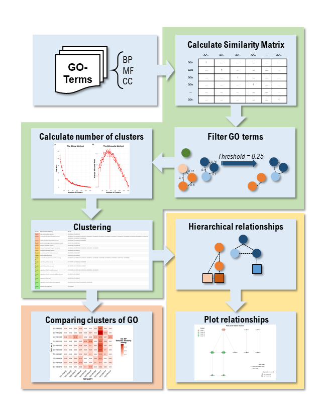

## Installation

You can install the development version of visualizeGO like so:

``` r
# install.packages("devtools")
devtools::install_github("maalg21/visualizeGO", force = TRUE)
```

## Pipeline

### Data input

The first step is to import the list (or lists) of GO-terms of interest. To exemplify the use of the package's functions, we will use one of the lists of enriched GO-terms obtained from [Alonso-García et al. (2023)](https://doi.org/10.3389/fvets.2023.1150996).

``` r
library(visualizeGO)
library(dplyr)
library(igraph)

data <- as.data.frame(readxl::read_xlsx(system.file("extdata", "GOTerms.xlsx", package = "visualizeGO")))
```

This table contains all the GO-terms enriched for one of the sample groups of the study taken as a reference, and will be the GO-terms we will use as a reference in this explanation. We only need the GO IDs and the Gene Ontology (GO) category to which they belong.

``` r
data <- data[,c("Category", "ID", "Padj")]

# To make it easier, we will divide the main table into three categories (entirely optional).
GO_BP <- data[data$Category == "BP",]
# GO_CC <- data[data$Category == "CC",]
# GO_MF <- data[data$Category == "MF",]
```

For the time being, we will only use GO-terms from the Biological Process (BP) 
category.

### Clustering the GO-terms

To make the grouping based on the degree of similarity that exists, we must 
calculate the similarity matrix between them. In this case, we choose 
[Wang's method](https://doi.org/10.1093/bioinformatics/btm087).

``` r
similarity_matrix <- calculate_wang(input_terms = GO_BP$ID, 
ontology = "BP", # We select the category to which our GO-terms belong.
OrgDb = "org.Hs.eg.db") # We use human annotation as a reference.
```

GO terms that demonstrate similarity above the designated ```threshold``` in a
minimum of half of the comparisons will be designated as connected. Consequently,
an elevated threshold will result in a reduced number of GO terms for clustering,
and the threshold should be interpreted as the minimum level of similarity between
GO terms. In the example, `threshold = 0.1` implies that a minimum similarity of
10% is required.

**This is not mandatory.** This step will depend above all on how conservative
you want to be in the analysis, using more or less similar terms for clustering.
In our case, we start with a list of 137 terms, which if we use a threshold of
10% is reduced to 89 terms. We will carry out the grouping with the two samples
to see how the clustering process behaves.


``` r
filtered_terms <- filter_terms(similarity_matrix = similarity_matrix,
threshold = 0.1)
similarity_matrix2 <- filtered_terms$similarity_matrix
```

From this function we obtain the filtered graph and several vectors of GO-terms:
(1) The connected GO-terms, (2) GO-Terms eliminated because they do not have a
similarity score above the threshold 
(*you will never find the input terms here even if they are not connected*), and 
(3) outliers (*those that are not similar to any other term*).

This filtering is important, especially when it comes to detecting outliers which, 
when we carry out the clustering, have a great influence on the distances between 
terms, making the clustering incorrect.

Following the filtration of the similarity matrix, the number of clusters into
which the GO terms are grouped is calculated. To this end, two different methods
are employed: the [Elbow](https://www.atlantis-press.com/proceedings/isstec-19/125944915) 
method and the [Silhouette](https://www.sciencedirect.com/science/article/pii/0377042787901257) 
method, based on the
[`fviz_nbclust`](https://www.rdocumentation.org/packages/factoextra/versions/1.0.7/topics/fviz_nbclust)
function of the 
[`factoextra`](https://rdocumentation.org/packages/factoextra/versions/1.0.7) 
package. Within this package, the `determine_nbclusters` function is presented,
which incorporates both methods in a single step, thereby enabling the user to
determine the number of clusters. 

K-means clustering is probably one of the best known partitioning methods. The idea
behind k-means clustering is to define groups in such a way that the total variation
within a group, which measures the compactness of the groups, is minimized. The
k-means algorithm is not deterministic, which means that the clustering results can
be different each time the algorithm is run, even on the same data set.

The silhouette score interpretation measures the quality of the Silhouette score
of k-means by evaluating the quality of grouping of data points within their assigned
clusters compared to data points in other clusters. On the other hand, the Elbow
method calculates and graphs the sum of squares for each number of clusters and
looks for a change in slope from steep to gentle (an elbow) to determine the optimal
number of clusters. 

For both methods, it's necessary to determine the `k_range`. This range includes
the number of clusters in which both methods will test the groupings. In this case,
we set this range from 1 (*all terms are included in the same cluster*) 
to the number of GO-terms (*i.e., each GO-term is in a cluster of its own*).

```r
set.seed(1234) # For reproducibility
# For the similarity matrix NOT filtered:
determine_nbclusters(similarity_matrix = similarity_matrix)
# Based on the Elbow method, the optimal number of clusters (k) is: 20 
# Based on the Silhouette method, the optimal number of clusters (k) is: 54
```
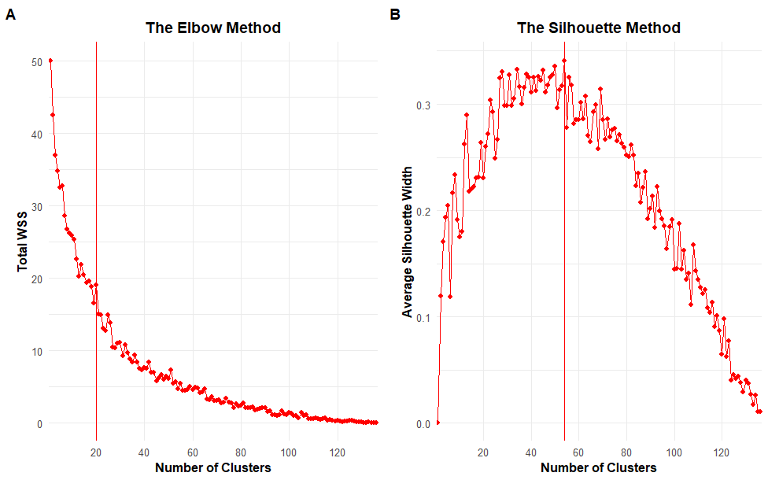

```r
# For the filtered similarity matrix:
determine_nbclusters(similarity_matrix = similarity_matrix2)
# Based on the Elbow method, the optimal number of clusters (k) is: 2 
# Based on the Silhouette method, the optimal number of clusters (k) is: 34
```
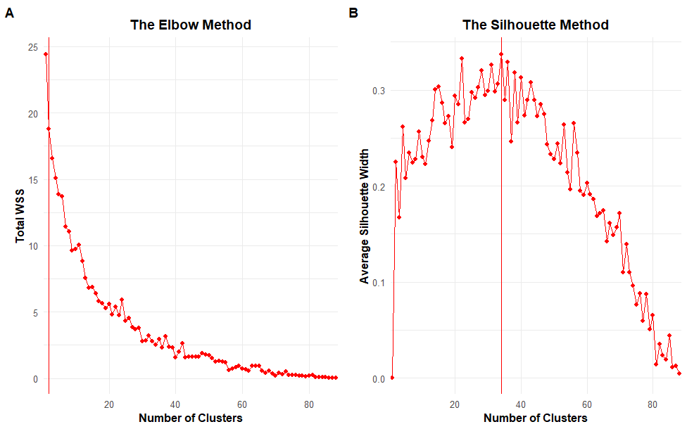

This function tells you the number of clusters in which your list of GO-terms 
input is grouped according to each method. In this case, after filtering out
terms that do not have a high similarity with the input GO-terms, when testing
the best number of clusters for our list of terms, each of the methods gives us
a different value. For this tutorial, we chose `nb_cluster = 54` based on the
Silhouette method.

``` r
cluster <- clusterGO(similarity_matrix = similarity_matrix,
nb_clusters = 54)
```

Also, let's see how the filtered terms cluster.
``` r
cluster2 <- clusterGO(similarity_matrix = similarity_matrix2,
nb_clusters = 34)
```
As this is a grouping by similarity, each cluster has a more representative
metabolic pathway associated with it, being the one that is more closely
related to the rest of the GO-terms within the cluster.

To see which groups have been detected, we use the `generate_cluster_table` function, which 
will give us a table (which we can be saved as a PNG) with the relationship of 
the clusters, the color they will have later in the final graph, the most 
representative pathway and which GO IDs belong to each cluster.

``` r
# colors <- generate_pastel_colors(n = 54) # This function was only created to generate a list of pastel colours of the number we determine 😊
generate_cluster_table(cluster_output = cluster, col_palette = colors, 
text_color = "black", file_name = NULL) # If you specify a name for the file, it will be saved as a PNG.
```
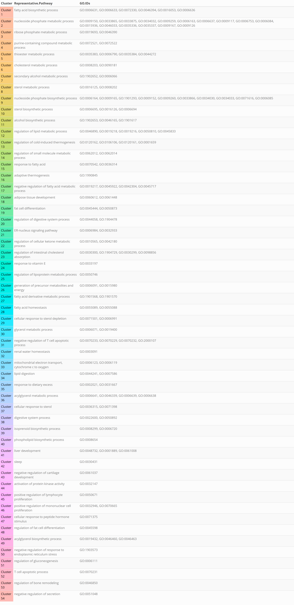 This is what the PNG output of 
our grouping looks like.

``` r
# colors <- generate_pastel_colors(n = 34) # This function was only created to generate a list of pastel colours of the number we determine 😊
generate_cluster_table(cluster_output = cluster2, col_palette = colors, 
text_color = "black", file_name = NULL) # If you specify a name for the file, it will be saved as a PNG.
```
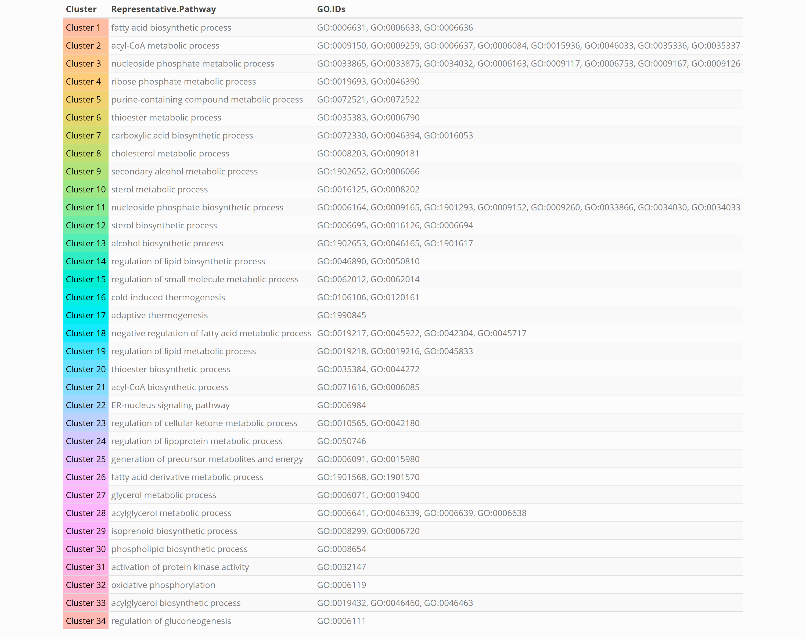 As we can see, the main clusters are almost the same.

Note that sometimes the GO IDs of the most representative path in the cluster 
do not exist in the [AnnotationDbi](https://bioconductor.org/packages/release/bioc/html/AnnotationDbi.html) 
database, which is the one we use for the identification of term's names from 
their ID. Therefore, in the table, instead of the term name in 
the *Representative Pathway* column, the GO ID will appear. We promise that 
we will try to improve this peculiarity by investigating more R annotation 
packages for GO IDs.

Furthermore, with the ```scatterGO``` function we can represent the GO terms as a
scatter plot represented by the first two components of a Principal Component Analysis
(PCA) of the similarity matrix. For this function, we can choose whether the size
of the dots that will represent the GO-terms is based on the size of the term based
on the number of genes related to it ("```gene```"), or based on the adjusted p-value
("```padj```") that characterises it in the previous analysis for its detection. If the
latter option is chosen, it should be borne in mind that the padj values are very
low, so we must provide the function with transformed values (*usually ```-log10(padj)```*).

``` r
scatterGO(similarity_matrix = similarity_matrix, 
cluster = cluster, 
colors = generate_pastel_colors(n = 54), 
title = "Distance Between GO-Terms", 
labels = T, size = "padj", 
scores = setNames(-log10(GO_BP$Padj), GO_BP$ID))
```
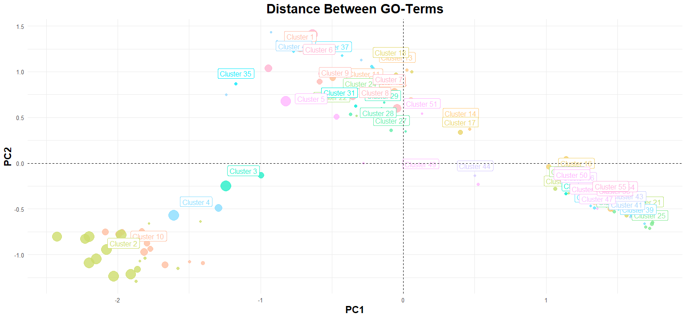

Similarly, another way of representing the grouping of GO terms is through
a tree map, where each rectangle is a GO term. Each term is linked to other
terms belonging to the same cluster, displayed in different colors, and with
the most representative pathway encompassing the cluster it represents.
The size of the rectangles depends on XXX.

```r
treeMap(cluster, size = "padj",
scores = setNames(-log10(GO_BP$Padj), GO_BP$ID),
title = "Distance Between GO-Terms",
colors = generate_pastel_colors(n = 54))
```
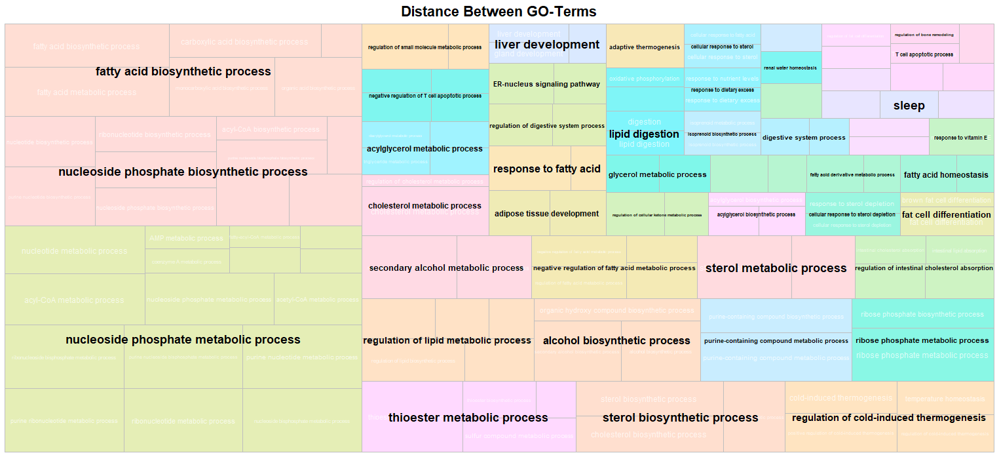

### Comparing lists of GO-terms

Finally, in order to be able to compare two lists of GO-terms or two lists of Clusters
we can also use this same package with the `compareGO` function. Thanks to this
function we obtain a heat map where it will be observed between which GO-terms there
is a greater similarity within the two lists. Of course, the measurement of distances
between GO-terms does not depend on a network of terms; therefore, we can only choose
between semantic similarity methods, such as Resnik, Lin, etc. to perform the analysis.

In this case it is **MANDATORY** that the input is two lists of GO-terms or two lists of
clusters of GO-terms. Using the same study as a basis, we will compare the two lists
of GO-terms that were detected for each of the groups of animals.

``` r
# This is the second list of GO-terms
data2 <- as.data.frame(readxl::read_xlsx(system.file("extdata", "GOTerms2.xlsx",
                                                     package = "visualizeGO")))

# We filter 10 GO-terms for each list, to make it more easy to understand
GO_BP1 <- data[data$Category == "BP", c("Category", "ID")] %>% top_n(n = 10)
GO_BP2 <- data2[data2$Category == "BP",] %>% top_n(n = 10)

compareGO(comparison = "GO",
list1 = GO_BP1$ID, list2 = GO_BP2$ID,
ontology = "BP", OrgDb = "org.Hs.eg.db",
method = "Wang", plot = T,
low = "white", high = "red3",
labs = c("GO List 1", "GO List 2"),
cex = 3, cex_axis = 10)
```

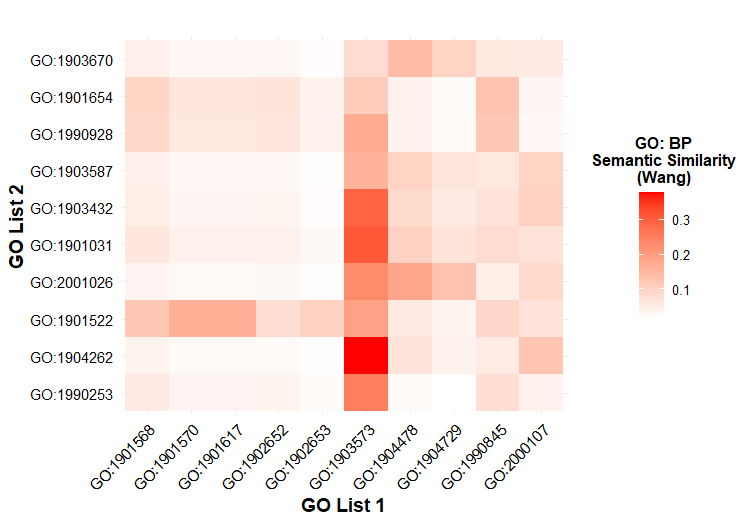

Here is a comparison of 10 GO-terms from each of the lists, with the highest similarity shown in red and the lowest in white.

Or, on the other hand, it is also possible to compare clusters of GO-terms that have
been previously detected by semantic similarity
(**or by other packages that make the clustering of GO-terms such as [rrvgo](https://www.bioconductor.org/packages/release/bioc/html/rrvgo.html)**).
In this case, the comparison can only be done with one of the similarity methods such
as Resnik, Lin or Wang.

In order to understand how this step would be done, the code below shows step by step
how to obtain the clusters for the second data table `data2`. Remember that
**ONLY** clusters of GO-terms of the same ontology category
*(BP vs BP, CC vs CC & MF vs MF)* can be compared. Also, it would not make
*biological* sense to compare clusters of GO-terms obtained through their
conformation in the network ... But you do you!
In this case we are going to compare how similar the clusters detected 
pre- and post-filtering are.

``` r
compareGO(comparison = "cluster",
list1 = cluster$clusters, list2 = cluster2$clusters,
ontology = "BP", OrgDb = "org.Hs.eg.db",
method = "Wang", combine = "BMA", plot = T,
low = "white", high = "red3",
labs = NULL,
cex = 3, cex_axis = 10)
```

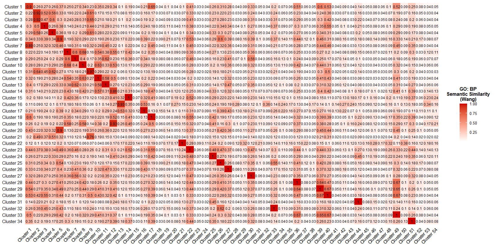

As we can see in the heatmap, there are many clusters that are common to both
analyses - *as expected*-. Although there are some unique clusters in the
analysis of the 54 clusters, such as Clusters 15, 18, 19, etc.

### Build the hierarchical graph

Before plotting the clusters in a hierarchical way, the first step in the 
use-flow of this package is to obtain the hierarchy relationships between 
the selected GO-terms. For this, we need an annotation file where all the 
semantic relations between terms are found by relating the GO IDs to each 
other. In this package you will find a file `go_term_database_all_ontologies` 
obtained from the R package 
[GOSemSim](https://bioconductor.org/packages/release/bioc/html/GOSemSim.html) 
where all these relations are. If you want to make this file yourself, we leave 
you a [script](https://github.com/maalg21/visualizeGO/blob/master/test/GOSimEnvironment.R) 
of how we have done it.

``` r
graph <- familyGO(cluster, go_sim_object = NULL)
```

The number of GO terms that require analysis is increased by obtaining all the parent 
and child terms from the list of input GO terms. In order to focus only on the input 
GO terms, the parental terms linked to more than one input GO term 
and the child terms that link two (or more) input GO terms. However, it is important 
to note that the filter does not remove those GO terms that are children of only one 
term but are parents of another, and these are included in the graph.

In this case, we will only use a single list of GO-terms. But the package allows 
us to obtain the semantic relations between two lists of GO-terms. From this final 
graph, we then grouped the GO-terms.

## Visualize GO-terms relationships

The last step is to represent the relationships between the GO-terms of interest in a hierarchical graph by differentiating the clusters. To do this, we will use the latest function of the `visualize_go_hierarchy` package. This function has many parameters to be able to characterize the graph as we like. In order to use it, you will have to take into account several aspects:

1.  You have to enter the initial list of GO-terms of interest (`go_list1`). You could add a second list (`go_list2`) as at the beginning of this tutorial, to see how the terms in these two lists relate to each other. Consequently, the argument (`nb_lists = "double"`) would be used.
2.  If you want to use another annotation, you will have to define it in `go_sim_object`. In this case, we will use the database that comes with the package.
3.  If you use two lists of GO-terms, you have to set the second form of the nodes for this second list. In this case, we only define `shape1`.
4.  The `simplification` parameter refers to whether we want to perform the same filtering as in the [Data Input](#data-input) step. It is important to note that if this simplification was performed before the clustering, we are forced to use it again.
5.  We can determine the layout of the graph through several options. If we want a hierarchical view we have to define `layout = "tree"`.
6.  If we want to add the clustering done in previous steps we must determine it with `clustering = T` and `clusters` as the output of the [Clustering the GO-terms](#clustering-the-go-terms) step.
7.  The `verbose` parameter is a bit special. It could be either *"all"*, *"some"* or *"none"* if you want all the results displayed, some feedback or anything in your console, respectively.
8.  We can save this plot directly from the function with `save_plot = T`.

``` r
visualizeGO(cluster = cluster, graph = graph,
shape1 = "square", min_node_size = 1, max_node_size = 10, 
layout = "tree", col_palette = colors, verbose = "some",
legend = T, ID = F)
```

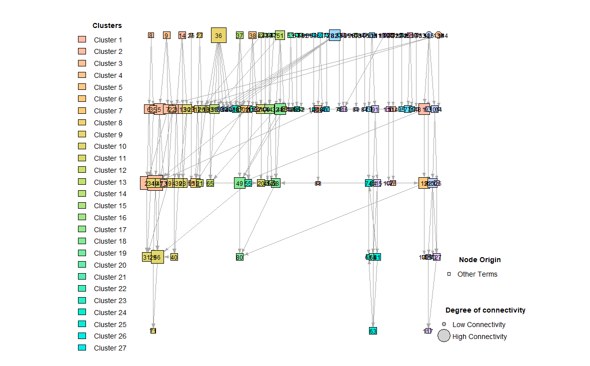 As
can be seen in the image, there are many nodes and inter-nodal relationships,
making the plot uninformative. Thus, we can focus on some of the clusters
to see what these relationships look like. This list of GO-terms is the result
of a functional enrichment analysis of differentially expressed genes obtained
from transcriptome analysis of adipose tissue from suckling lambs
[(Alonso-García et al., 2023)](https://doi.org/10.3389/fvets.2023.1150996).
Thus, we are going to focus on **Clusters 1, 18, 19 & 20** which are related
to lipid metabolism.

``` r
visualizeGO(cluster = cluster, selected_cluster = c(1,18,19,20), 
shape1 = "square", min_node_size = 2.5, max_node_size = 10, 
layout = "tree", col_palette = colors[c(1,18,19,20)], 
title = "Fatty acid related clusters",
verbose = "some", legend = T, ID = T,
labs = "Alonso-García et al. (2023)")
```

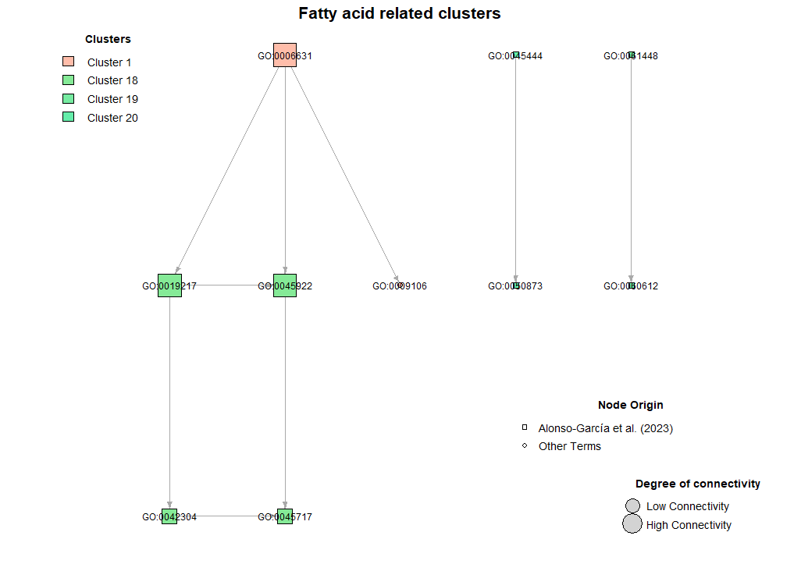 This function, in addition to filtering
the above graph according to the clusters we want, also gives us a table
with the GO IDs relationship and the term description that we can save as
a PNG.

## References

1.  Alonso-García et al. (2023) Transcriptome analysis of perirenal fat from Spanish Assaf suckling lamb carcasses showing different levels of kidney knob and channel fat. *Frontiers in Veterinary Science*, 10 [10.3389/fvets.2023.1150996](https://doi.org/10.3389/fvets.2023.1150996)
2.  Umargono et al. (2020) K-Means Clustering Optimization Using the Elbow Method and Early Centroid Determination Based on Mean and Median Formula. *Proceedings of the 2nd International Seminar on Science and Technology*, ISSTEC 2019 [10.2991/assehr.k.201010.019](https://www.atlantis-press.com/proceedings/isstec-19/125944915)
3.  Rousseeuw (1987) Silhouettes: A graphical aid to the interpretation and validation of cluster analysis. *Journal of Computational and Applied Mathematics*, 20: 53-65 [10.1016/0377-0427(87)90125-7](https://doi.org/10.1016/0377-0427(87)90125-7)
4.  Wang et al. (2007) A new method to measure the semantic similarity of GO terms. *Bioinformatics*, 23(10): 1274-1281 [10.1093/bioinformatics/btm087](https://doi.org/10.1093/bioinformatics/btm087)
5.  Pons & Latapy (2005) Computing Communities in Large Networks Using Random Walks. In: *Computer and Information Sciences*, 3733 [10.1007/11569596_31](https://doi.org/10.1007/11569596_31)

## Contribution

We welcome contributions to this project! There are several ways you can help:

### Reporting Bugs

If you encounter any bugs or issues, please report them by opening an [issue](https://github.com/maalg21/visualizeGO/issues). Make sure to include a clear description of the problem, steps to reproduce, and any relevant screenshots or logs.

### Requesting Features

If you have an idea for a new feature or improvement, feel free to create a [feature request](https://github.com/maalg21/visualizeGO/issues). Be as detailed as possible, and explain why the feature would be valuable.

### Contributing Code

To contribute code to this project, follow these steps:

1.  Fork the repository.
2.  Create a new branch for your changes (`git checkout -b feature/your-feature`).
3.  Make your changes.
4.  Commit your changes (`git commit -am 'Add new feature'`).
5.  Push to your forked repository (`git push origin feature/your-feature`).
6.  Create a pull request to the `main` branch of the original repository.

### Code of Conduct

Please follow our [Code of Conduct](./CODE_OF_CONDUCT.md) when participating in the project to ensure a respectful and welcoming environment for all contributors.

Thank you for helping to improve this project!😊

## Licence

This package is licensed under the [MIT License](https://opensource.org/licenses/MIT).

Copyright (c) 2025 Alonso-García, M.

Permission is hereby granted, free of charge, to any person obtaining a copy of this software and associated documentation files (the "Software"), to deal in the Software without restriction, including without limitation the rights to use, copy, modify, merge, publish, distribute, sublicense, and/or sell copies of the Software, and to permit persons to whom the Software is provided to do so, subject to the following conditions:

The above copyright notice and this permission notice shall be included in all copies or substantial portions of the Software.

THE SOFTWARE IS PROVIDED "AS IS", WITHOUT WARRANTY OF ANY KIND, EXPRESS OR IMPLIED, INCLUDING BUT NOT LIMITED TO THE WARRANTIES OF MERCHANTABILITY, FITNESS FOR A PARTICULAR PURPOSE, AND NONINFRINGEMENT. IN NO EVENT SHALL THE AUTHORS OR COPYRIGHT HOLDERS BE LIABLE FOR ANY CLAIM, DAMAGES, OR OTHER LIABILITY, WHETHER IN AN ACTION OF CONTRACT, TORT, OR OTHERWISE, ARISING FROM, OUT OF, OR IN CONNECTION WITH THE SOFTWARE OR THE USE OR OTHER DEALINGS IN THE SOFTWARE.
