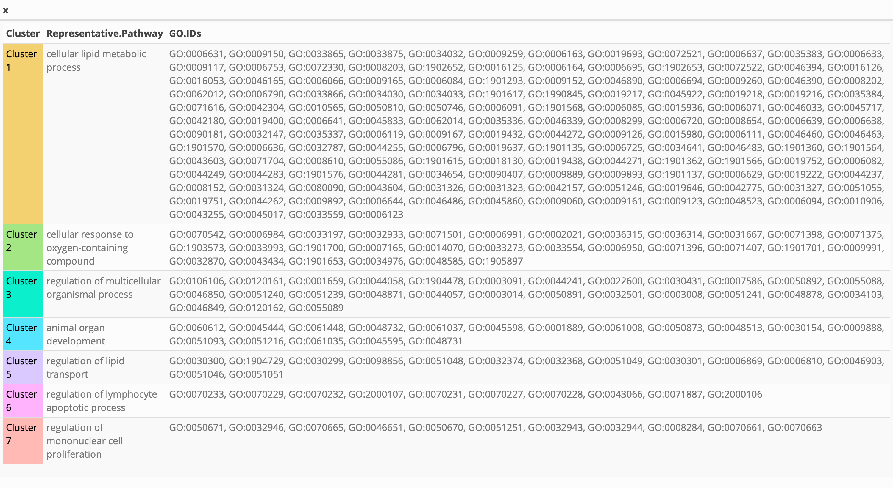

# visualizeGO

<!-- badges: start -->
<!-- badges: end -->

**INDEX**

- 📝 [Introduction](#introduction)
- 🛠️ [Installation](#installation)
- 💻 [Basic Use](#basic-use)
- 📚 [References](#references)
- 🤝 [Contribution](#contribution)
- 📜 [Licence](#licence)

## Introduction
**visualizeGO** has been developed in order to create hierarchical graphs of a list of interesting GO terms. 
The package uses a clustering method to group GO terms, making it easier to observe the relationships between these terms. 
This process improves the understanding of the intracluster relationships of the highlighted metabolic pathways.

The package consists of several important parts:  
1. **Creation of a network of GO terms.** Here the list of GO terms of interest is analysed and, 
through the [GOSemSim](https://bioconductor.org/packages/release/bioc/html/GOSemSim.html) R package, 
the hierarchically related terms - both "*parents*" and "*children*" - to the input terms are obtained.  
2. **Clustering.** In this part you can select the type of grouping you want to make of the terms. 
This grouping can be based on semantic similarity metrics *(Jaccard Index, Resnik, Lin or Wang methods)* 
or by how the term network itself is configured. You do you!  
3. **Final visualisation.** This final graph shows the input GO-terms and their relationships with other GO-terms, 
and the clusters that are formed, all in the form of a network.


## Installation

You can install the development version of visualizeGO like so:

``` r
# install.packages("devtools")
devtools::install_github("maalg21/visualizeGO")
```

## Basic Use
### Data input
The first step is to import the list (or lists) of GO-terms of interest. To exemplify the use of the package's functions, 
we will use one of the lists of enriched GO-terms obtained from [Alonso-García et al. (2023)](https://doi.org/10.3389/fvets.2023.1150996). 

``` r
library(visualizeGO)

data <- as.data.frame(readxl::read_xlsx(system.file("extdata", "GOTerms.xlsx", package = "visualizeGO")))
```
This table contains all the GO-terms enriched for one of the sample groups of the study taken as a reference, 
and will be the GO-terms we will use as a reference in this explanation. We only need the GO IDs and the Gene Ontology (GO) 
category to which they belong.

``` r
data <- data[,c("Category", "ID")]

# To make it easier, we will divide the main table into three categories (entirely optional).
GO_BP <- data[data$Category == "BP",]
# GO_CC <- data[data$Category == "CC",]
# GO_MF <- data[data$Category == "MF",]
```
For the time being, we will only use GO-terms from the Biological Process (BP) category.

### Build the hierarchical graph
The first step in the use-flow of this package is to obtain the similarity and hierarchy 
relationships between the selected GO-terms. For this, we need an annotation file where 
all the semantic relations between terms are found by relating the GO IDs to each other. 
In this package you will find a file ```go_term_database_all_ontologies``` obtained from the 
R package [GOSemSim](https://bioconductor.org/packages/release/bioc/html/GOSemSim.html) 
where all these relations are. If you want to make this file yourself, 
we leave you a [script]() of how we have done it.

``` r
graph <- build_hierarchical_graph(go_list1 = GO_BP$ID, nb_lists = "single", 
go_sim_object = NULL)
```

In this case, we will only use a single list of GO-terms. But the package allows us 
to obtain the semantic relations between two lists of GO-terms. Once we have created 
the initial graph - *where ALL semantic relations are annotated* - we filter this graph, 
to keep only the most informative relations (*those directly related to the terms of interest*).

This first function filters out those nodes (GO-terms) that are not connected to any of the GO-terms used as input.
``` r
expanded_graph <- expand_graph(graph = graph, 
                               go_list1 = GO_BP$ID,
                               nb_lists = "single")
```

Next, we retain the ancestor GO-terms of those used as input.
``` r
final_graph <- retain_ancestors_above_input_terms(graph = expanded_graph, 
                                                  go_list1 = GO_BP$ID, 
                                                  nb_lists = "single")
```
From this final graph, we then grouped the GO-terms.

### Clustering the GO-terms
The package allows you to make mainly two types of groupings: 
1. According to the degree of similarity that exists between the GO-terms.
2. According to the network of GO-terms itself.

The function ```cluster_go_terms``` assigns cluster memberships to the graph nodes (GO terms) based on the chosen network clustering method.
The function has two main modes of operation: (1) Similarity-based clustering using a similarity matrix and
performs hierarchical clustering, and assigns GO terms to clusters. It uses silhouette scores to determine
the optimal number of clusters (nb_clusters) from a specified range. (2) Network-based clustering,
this method requires a network object (e.g., an igraph object) representing GO terms and their relationships.
It supports various network clustering methods: Walktrap, Louvain, or EdgeBetweenness.

To see how both clustering methods behave, we will perform both and check how our GO-terms are grouped.

#### Clustering the GO-terms using Wang Similarity Method
To make the grouping based on the degree of similarity that exists, 
we must calculate the similarity matrix between them. In this case, 
we choose [Wang's method](https://doi.org/10.1093/bioinformatics/btm087).
``` r
similarity_matrix <- calculate_wang(graph = final_graph, # From the graph, we get the nodes.
ontology = "BP", # We select the category to which our GO-terms belong.
orgdb = "org.Hs.eg.db") # We use human annotation as a reference.
```
Once the similarity matrix is obtained, we calculate - *through the Silhouette Method* - 
the number of clusters in which the GO-terms are grouped.
```r
cluster <- cluster_go_terms(method_type = "similarity", method = "wang", 
orgdb = "org.Hs.eg.db", ontology = "BP", similarity_matrix = similarity_matrix, 
graph = final_graph, nb_clusters = NULL, k_range = 2:10)
```
This function tells you the number of clusters in which your list of GO-terms input 
is grouped according to the Silhouette method. In addition, it is also possible to know 
the number of clusters through ```clusters$nb_clusters```. 

In our case, 7 clusters have been detected. As this is a grouping by similarity, 
each cluster has a more representative metabolic pathway associated with it, 
being the one that is more closely related to the rest of the GO-terms within the cluster.

To see what 7 clusters are, we use the ```generate_cluster_table``` function, 
which will give us a table (which we can later save as a PNG) with the relationship of 
the clusters, the colour they will have later in the final graph, the most representative 
pathway and which GO IDs belong to each cluster.
```r
# colors <- generate_pastel_colors(n = 7) # This function was only created to generate a list of pastel colours of the number we determine 😊
Table <- generate_cluster_table(cluster_output = cluster, method_type = "similarity", 
similarity_matrix = similarity_matrix, text_color = "black", col_palette = colors)
```

To save the table as PNG we will use the ```save_cluster_table_as_png``` function.
```r
save_cluster_table_as_png(cluster_df = Table, file_name = "cluster_table.png", 
width = 1500, height = 600,zoom = 2)
```

 This is what the PNG output of our grouping looks like.

#### Clustering the GO-terms based on the network
In this case, the grouping of GO-terms is based on how the terms relate to each other 
and how the network behaves. Unlike the similarity-based method, in this case we do not 
obtain a more representative metabolic pathway for each term.

We choose for this the *Edge Betweenness* method. The Edge Betweenness method is a 
network clustering algorithm used to identify communities or clusters of nodes in a 
graph or network. This method is based on the idea of edge betweenness centrality, 
which measures the number of shortest paths that pass through a given edge. 
By focusing on edges that connect different clusters, the Edge Betweenness method 
iteratively removes edges that are critical for connecting different parts of the network, 
revealing communities or clusters of nodes.
```r
edge <- cluster_go_terms(method_type = "network", method = "EdgeBetweenness", 
graph = final_graph, ontology = "BP", orgdb = "org.Hs.eg.db")
```
A look at the ```network$clusters``` object shows that we have obtained 35 clusters.

Using other method - *Walktrap method* - we get 29 clusters. 
This method is a community detection algorithm used to cluster nodes in a network 
(graph) based on their structural properties. It is based on the idea that nodes 
in the same community are more likely to be reachable from each other by short 
random walks than nodes from different communities. This method was proposed 
by [Pons & Latapy (2005)](https://doi.org/10.1007/11569596_31) in the context 
of social networks and other complex systems.
```r
walk <- cluster_go_terms(method_type = "network", method = "Walktrap", 
graph = final_graph, ontology = "BP", orgdb = "org.Hs.eg.db")
```
Once we have the groupings based on the method we preferred, we can also obtain a 
table indicating which GO terms each cluster is composed of by using the 
same ```generate_cluster_table``` function.

```r
# colors <- generate_pastel_colors(n = 35)
generate_cluster_table(cluster_output = edge, method_type = "network", 
col_palette = colors, text_color = "black")
```


As is evident, in this particular instance, the utilisation of clustering 
techniques based on the semantic similarity of GO-terms is significantly more 
efficacious and substantially reduces the amount of information obtained. 
Consequently, the tutorial will persist in its utilisation of this information 
in accordance with Wang's method.

## Visualize GO-terms relationships
The last step is to represent the relationships between the GO-terms of interest 
in a hierarchical graph by differentiating the clusters. To do this, 
we will use the latest function of the ``visualize_go_hierarchy`` package. 
This function has many parameters to be able to characterise the graph as we like. 
In order to use it, you will have to take into account several aspects:

1. You have to enter the initial list of GO-terms of interest (```go_list1```). You could add a second list (```go_list2```) as at the beginning of this tutorial, to see how the terms in these two lists relate to each other. Consequently, the argument (```nb_lists = "double"```) would be used.
2. If you want to use another annotation, you will have to define it in ``go_sim_object``. In this case, we will use the database that comes with the package.
3. If you use two lists of GO-terms, you have to set the second form of the nodes for this second list. In this case, we only define ```shape1```.
4. The ```simplification``` parameter refers to whether we want to perform the same filtering as in the #data_input step. It is important to note that if this simplification was performed before the clustering, we are forced to use it again.
5. We can determine the layout of the graph through several options. If we want a hierarchical view we have to define ```layout = "tree"```.
6. If we want to add the clustering done in previous steps we must determine it with ```clustering = T``` and ```clusters``` as the output of the [Clustering the GO-terms](#clustering-the-go-terms) step.
7. The ```verbose``` parameter is a bit special. It could be either *"all"*, *"some"* or *"none"* if you want all the results desplayed, some feedback or anything in your console, respectively.
8. We can save this plot directly from the function with ```save_plot = T```.

```r
visualize_go_hierarchy(go_list1 = GO_BP$ID, 
go_list2 = NULL, 
nb_lists = "single", 
go_sim_object = NULL, 
shape1 = "circle", # By default, it would be circles
shape2 = NULL, 
ontology = "BP", 
simplification = T, 
min_node_size = 1, max_node_size = 10, # This is optional and arbitrary
layout = "tree", 
clustering = T, clusters = clusters, 
col_palette = colors, 
verbose = "some"", # Just to know more about the process that is ocurring
save_plot = F)
```

## References
1. Alonso-García et al. (2023) Transcriptome analysis of perirenal fat from Spanish Assaf suckling lamb carcasses showing different levels of kidney knob and channel fat. *Frontiers in Veterinary Science*, 10 [10.3389/fvets.2023.1150996](https://doi.org/10.3389/fvets.2023.1150996)
2. Wang et al. (2007) A new method to measure the semantic similarity of GO terms. *Bioinformatics*, 23(10): 1274-1281 [10.1093/bioinformatics/btm087](https://doi.org/10.1093/bioinformatics/btm087)
3. Rousseeuw (1987) Silhouettes: A graphical aid to the interpretation and validation of cluster analysis. *Journal of Computational and Applied Mathematics*, 20: 53-65 [10.1016/0377-0427(87)90125-7](https://doi.org/10.1016/0377-0427(87)90125-7)
4. Pons & Latapy (2005) Computing Communities in Large Networks Using Random Walks. In: *Computer and Information Sciences*, 3733 [10.1007/11569596_31](https://doi.org/10.1007/11569596_31)

## Contribution

We welcome contributions to this project! There are several ways you can help:

### Reporting Bugs
If you encounter any bugs or issues, please report them by opening an [issue](https://github.com/maalg21/visualizeGO/issues). Make sure to include a clear description of the problem, steps to reproduce, and any relevant screenshots or logs.

### Requesting Features
If you have an idea for a new feature or improvement, feel free to create a [feature request](https://github.com/maalg21/visualizeGO/issues). Be as detailed as possible, and explain why the feature would be valuable.

### Contributing Code
To contribute code to this project, follow these steps:

1. Fork the repository.
2. Create a new branch for your changes (`git checkout -b feature/your-feature`).
3. Make your changes.
4. Commit your changes (`git commit -am 'Add new feature'`).
5. Push to your forked repository (`git push origin feature/your-feature`).
6. Create a pull request to the `main` branch of the original repository.

### Code of Conduct
Please follow our [Code of Conduct](./CODE_OF_CONDUCT.md) when participating in the project to ensure a respectful and welcoming environment for all contributors.

Thank you for helping to improve this project!😊

## Licence
This package is licensed under the [MIT License](https://opensource.org/licenses/MIT).

Copyright (c) 2025 Alonso-García, M.

Permission is hereby granted, free of charge, to any person obtaining a copy of this software and associated documentation files (the "Software"), to deal in the Software without restriction, including without limitation the rights to use, copy, modify, merge, publish, distribute, sublicense, and/or sell copies of the Software, and to permit persons to whom the Software is provided to do so, subject to the following conditions:

The above copyright notice and this permission notice shall be included in all copies or substantial portions of the Software.

THE SOFTWARE IS PROVIDED "AS IS", WITHOUT WARRANTY OF ANY KIND, EXPRESS OR IMPLIED, INCLUDING BUT NOT LIMITED TO THE WARRANTIES OF MERCHANTABILITY, FITNESS FOR A PARTICULAR PURPOSE, AND NONINFRINGEMENT. IN NO EVENT SHALL THE AUTHORS OR COPYRIGHT HOLDERS BE LIABLE FOR ANY CLAIM, DAMAGES, OR OTHER LIABILITY, WHETHER IN AN ACTION OF CONTRACT, TORT, OR OTHERWISE, ARISING FROM, OUT OF, OR IN CONNECTION WITH THE SOFTWARE OR THE USE OR OTHER DEALINGS IN THE SOFTWARE.
